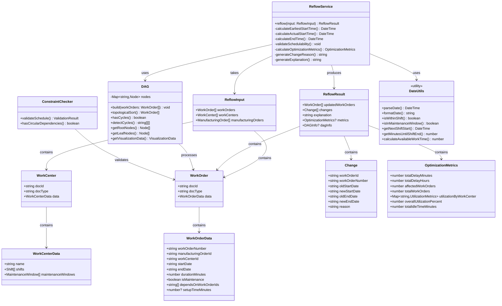

# Production Schedule Reflow System

A production schedule reflow system for rescheduling work orders while respecting dependencies, work center conflicts, shift boundaries, and maintenance windows. Built for the Naologic technical test.

## Overview

This system implements a reflow algorithm that intelligently reschedules work orders when disruptions occur in a manufacturing facility. The algorithm respects:

- **Dependencies**: Work orders can depend on multiple parent orders (all must complete first)
- **Work Center Conflicts**: No overlapping work orders on the same work center
- **Shift Boundaries**: Work pauses outside shift hours and resumes in the next shift
- **Maintenance Windows**: Blocked time periods where no work can occur
- **Maintenance Orders**: Fixed work orders that cannot be rescheduled

### Key Features

✅ **Complete Shift-Aware Duration Calculation** - Work pauses at shift boundaries and resumes in the next shift  
✅ **Dependency Management** - Handles complex dependency chains with cycle detection  
✅ **Work Center Scheduling** - Prevents conflicts by scheduling orders sequentially  
✅ **Maintenance Window Handling** - Automatically skips maintenance windows during scheduling  
✅ **Setup Time Handling** - Optional setup time included in work duration calculations  
✅ **Impossible Schedule Detection** - Validates and explains why constraints cannot be satisfied  
✅ **Optimization Metrics** - Calculates total delay, utilization, and idle time analysis  
✅ **Professional UI** - React-based interface with interactive visualizations  
✅ **Gantt Chart Visualization** - Professional Gantt chart with zoom and scale controls  
✅ **DAG Visualization** - Interactive dependency graph using React Flow  
✅ **Comprehensive Sample Data** - 7 test scenarios including edge cases and large-scale tests  
✅ **Automated Test Suite** - 27 comprehensive tests covering all features  

## Tech Stack

- **React 18** - UI framework
- **TypeScript** - Type safety
- **Vite** - Build tool and dev server
- **Luxon** - Date/time manipulation
- **@jaeungkim/gantt-chart** - Professional Gantt chart library
- **React Flow** - Interactive DAG visualization

## Getting Started

### Prerequisites

- Node.js 18+ and npm

### Installation

```bash
npm install
```

### Development

```bash
npm run dev
```

This will start the development server at `http://localhost:5173`

### Build

```bash
npm run build
```

### Preview Production Build

```bash
npm run preview
```

## Project Structure

```
src/
├── reflow/                              # Core algorithm
│   ├── reflow.service.ts                # Main reflow algorithm
│   ├── reflow.service.test.ts           # Core scenario tests
│   ├── reflow.service.edge-cases.test.ts # Edge case tests
│   ├── constraint-validation.test.ts    # Constraint validation tests
│   ├── dag.ts                           # DAG implementation (topological sort, cycle detection)
│   ├── constraint-checker.ts             # Validation logic (placeholder)
│   └── types.ts                         # TypeScript interfaces
├── components/
│   ├── ProfessionalGanttChart.tsx       # Gantt chart wrapper
│   ├── ProfessionalGanttChart.css       # Gantt chart styles
│   ├── DAGVisualization.tsx             # React Flow DAG visualization
│   ├── DAGVisualization.css             # DAG styles
│   ├── GanttChart.tsx                   # Legacy Gantt chart (not used)
│   └── GanttChart.css                   # Legacy styles (not used)
├── utils/
│   └── date-utils.ts                    # Date helpers (Luxon)
├── App.tsx                              # Main React component
├── App.css                              # App styles
├── main.tsx                             # Entry point
└── index.css                            # Global styles

sample-data/
├── scenario-1-delay-cascade.json       # Basic delay cascade (4 orders)
├── scenario-2-shift-maintenance.json    # Shift & maintenance (4 orders)
├── scenario-3-complex.json              # Complex dependencies (5 orders)
├── scenario-4-edge-cases.json           # Edge cases (20 orders)
├── scenario-5-large-scale.json          # Large-scale (1,075 orders)
├── scenario-6-super-large.json          # Super large-scale (10,000 orders)
├── test-shift-calculation.json          # Simple shift test (1 order)
└── README.md                            # Sample data documentation

scripts/
├── generate-large-sample.js             # Script to generate large sample data
└── generate-super-large-sample.js       # Script to generate super large sample data
```

## Usage

1. Open the application in your browser (`http://localhost:5173`)
2. Enter JSON data in the format specified in `BE-technical-test.md`
3. Click "Run Reflow" to process the schedule
4. View the results showing:
   - **Updated Work Orders** - New schedule with adjusted dates
   - **Changes** - Detailed list of what moved and why
   - **Explanation** - Summary of all changes
   - **Optimization Metrics** - Total delay, utilization, and idle time analysis
   - **Dependency Graph** - Interactive visualization of work order dependencies
   - **Gantt Chart** - Visual timeline of the production schedule

### Quick Test

Try the simple test scenario to verify shift-aware calculation:

1. Copy the contents of `sample-data/test-shift-calculation.json`
2. Paste into the JSON input field
3. Click "Run Reflow"
4. Verify: Work order starting Monday 4 PM with 120 min duration should end **Tuesday 9 AM** (not Monday 6 PM)

## Architecture & Design

### System Architecture

The following UML class diagram illustrates the main components and their relationships:



### Data Flow

```
Input (ReflowInput)
    ↓
ReflowService.reflow()
    ↓
1. Separate maintenance orders
    ↓
2. Build DAG from work orders
    ↓
3. Detect cycles (if any → error)
    ↓
4. Topological sort (dependency order)
    ↓
5. For each work order in order:
    ├─ Calculate earliest start (dependencies)
    ├─ Calculate actual start (work center conflicts)
    ├─ Validate schedulability
    ├─ Calculate end time (shifts + maintenance)
    └─ Record changes
    ↓
6. Calculate optimization metrics
    ↓
7. Generate explanation
    ↓
Output (ReflowResult)
```

## Algorithm Approach

The reflow algorithm uses:

1. **Topological Sort** - Processes work orders in dependency order using Kahn's algorithm
2. **Forward Scheduling** - Schedules each order as early as possible while respecting constraints
3. **Shift-Aware Duration Calculation** - Tracks working minutes (not elapsed time), pauses at shift boundaries, resumes at next shift start
4. **Setup Time Handling** - Includes optional setup time in total work duration (setup time counts as working time within shifts)
5. **Constraint Checking** - Validates dependencies, work center conflicts, shifts, and maintenance windows

### Shift-Aware Calculation Example

**Input:**
- Start: Monday 4:00 PM
- Duration: 120 minutes
- Setup Time: 30 minutes (optional)
- Shift: Mon-Fri 8 AM - 5 PM

**Process:**
1. Works 60 minutes Monday (4 PM → 5 PM) - includes setup + production
2. Pauses at shift end (5 PM)
3. Resumes Tuesday 8 AM
4. Works remaining 90 minutes (8 AM → 9:30 AM)

**Result:** End time = Tuesday 9:30 AM ✅

**Note:** Setup time is included in total working time and respects shift boundaries just like production time.

## Design Decisions & Trade-offs

This section explains the key design decisions made in implementing the reflow algorithm and why certain approaches were chosen over alternatives.

### Forward Scheduling vs. Backward Scheduling

**Decision:** Forward scheduling (schedule as early as possible)

**Rationale:**
- Forward scheduling starts from the earliest possible time and schedules tasks sequentially, ensuring dependencies are respected by scheduling parent tasks before children.
- This approach is intuitive for rescheduling scenarios where disruptions occur and tasks need to be moved forward in time.
- It naturally handles dependencies by processing tasks in topological order, ensuring parents complete before children.

**Trade-offs:**
- **Pros:** Simple to implement, guarantees dependency satisfaction, naturally handles cascading delays
- **Cons:** Does not optimize for due dates or minimize delays; may schedule tasks earlier than necessary
- **Alternative considered:** Backward scheduling (from due dates) would be better for deadline optimization but adds complexity and requires due date information for all tasks

### Topological Sort: Kahn's Algorithm

**Decision:** Kahn's algorithm for topological sorting

**Rationale:**
- Kahn's algorithm is straightforward to implement and understand
- It efficiently handles the dependency graph with O(V + E) complexity
- It naturally provides cycle detection as a byproduct
- It produces a deterministic ordering when multiple valid orderings exist

**Trade-offs:**
- **Pros:** Simple, efficient, deterministic output, built-in cycle detection
- **Cons:** Does not consider task priorities or durations when breaking ties
- **Alternative considered:** DFS-based topological sort would also work but is less intuitive; priority-based sorting could optimize for task durations but adds complexity

### "As Early As Possible" Strategy vs. Optimization Algorithms

**Decision:** Greedy "as early as possible" scheduling

**Rationale:**
- This approach prioritizes simplicity and correctness over optimization
- It guarantees all constraints are satisfied (dependencies, work center conflicts, shifts, maintenance)
- It produces deterministic, predictable results
- The focus is on constraint satisfaction rather than minimizing delays or maximizing utilization

**Trade-offs:**
- **Pros:** Simple, fast, guarantees constraint satisfaction, deterministic
- **Cons:** Does not minimize delays or optimize utilization; may produce suboptimal schedules
- **Alternative considered:** Optimization algorithms (genetic algorithms, simulated annealing, constraint programming) could minimize delays but would be significantly more complex and slower, and may not guarantee constraint satisfaction

### DAG Implementation for Dependency Management

**Decision:** Custom DAG class with topological sort and cycle detection

**Rationale:**
- Encapsulates dependency logic in a reusable class
- Provides cycle detection to prevent invalid schedules
- Enables future enhancements (critical path calculation, visualization)
- Separates concerns from the main scheduling algorithm

**Trade-offs:**
- **Pros:** Clean separation of concerns, reusable, extensible, provides cycle detection
- **Cons:** Additional abstraction layer (minimal overhead)
- **Alternative considered:** Inline dependency checking would be simpler but less maintainable and harder to extend

### Shift-Aware Duration Calculation: Iterative Approach

**Decision:** Iterative minute-by-minute calculation for shift-aware scheduling

**Rationale:**
- Accurately handles complex scenarios (multiple shifts, maintenance windows, shift boundaries)
- Tracks working minutes (not elapsed time) correctly
- Handles edge cases (maintenance windows during shifts, multiple shift boundaries)
- More accurate than approximation methods

**Trade-offs:**
- **Pros:** Highly accurate, handles all edge cases, correct working time calculation
- **Cons:** More complex than simple duration addition; requires careful implementation
- **Alternative considered:** Simple duration addition would be faster but incorrect (doesn't account for shift boundaries or maintenance windows)

### React UI with Professional Libraries

**Decision:** React + @jaeungkim/gantt-chart + React Flow

**Rationale:**
- Professional libraries provide polished, production-ready visualizations
- Saves development time while providing excellent UX
- React enables interactive, responsive UI
- Separates visualization from algorithm logic

**Trade-offs:**
- **Pros:** Professional appearance, faster development, better UX, maintainable
- **Cons:** Additional dependencies, less control over visualization details
- **Alternative considered:** Custom visualizations would provide more control but require significantly more development time and may have lower quality

### Summary

The implementation prioritizes **correctness and simplicity** over optimization. All design decisions favor:
- **Constraint satisfaction** over optimization
- **Simplicity** over complexity
- **Deterministic results** over optimization heuristics
- **Maintainability** over performance tuning

This approach ensures the algorithm works correctly for all scenarios while remaining understandable and maintainable. Future enhancements could add optimization layers on top of this solid foundation.

## Sample Data

The `sample-data/` directory contains 7 comprehensive test scenarios:

1. **scenario-1-delay-cascade.json** - Basic delay cascade effect
2. **scenario-2-shift-maintenance.json** - Shift boundaries and maintenance windows
3. **scenario-3-complex.json** - Complex dependency chains
4. **scenario-4-edge-cases.json** - Edge cases (20 orders, multiple constraints)
5. **scenario-5-large-scale.json** - Large-scale test (1,075 orders)
6. **scenario-6-super-large.json** - Super large-scale test (10,000 orders)
7. **test-shift-calculation.json** - Simple shift calculation test

See `sample-data/README.md` for detailed descriptions of each scenario.

## Features

### Core Algorithm
- ✅ Complete shift-aware duration calculation
- ✅ Dependency chain handling (A → B → C)
- ✅ Multiple parent dependencies (all must complete first)
- ✅ Work center conflict prevention
- ✅ Maintenance window skipping
- ✅ Maintenance order protection (cannot be rescheduled)
- ✅ Setup time handling (bonus feature)
- ✅ Impossible schedule detection (bonus feature)
- ✅ Optimization metrics calculation (bonus feature)

### DAG Implementation
- ✅ Topological sort (Kahn's algorithm)
- ✅ Cycle detection (DFS-based)
- ✅ Root/leaf node identification
- ✅ Visualization data generation

### UI Features
- ✅ JSON input with validation
- ✅ Professional Gantt chart with zoom controls
- ✅ Interactive DAG visualization (React Flow)
- ✅ Detailed change explanations
- ✅ Error handling and display
- ✅ Responsive design

### Gantt Chart Features
- ✅ Zoom in/out controls (50% - 300%)
- ✅ Scale selector (Day/Week/Month/Year)
- ✅ Drag to move tasks
- ✅ Resize by dragging edges
- ✅ Dependency arrows
- ✅ Pan support

## Testing

### Automated Test Suite

The project includes a comprehensive automated test suite using Vitest:

```bash
# Run all tests
npm test

# Run tests in watch mode
npm test -- --watch

# Run tests with UI
npm run test:ui

# Run tests once (CI mode)
npm run test:run
```

**Test Coverage:**
- ✅ **3+ Scenarios** - Delay cascade, shift/maintenance, complex dependencies
- ✅ **Edge Cases** - Circular dependencies, impossible schedules, maintenance orders
- ✅ **Constraint Validation** - Work center conflicts, dependencies, shifts, maintenance windows
- ✅ **Setup Time** - Setup time handling across shifts and maintenance windows
- ✅ **Impossible Schedules** - Detection and detailed explanations when constraints cannot be satisfied
- ✅ **Optimization Metrics** - Total delay, utilization, idle time analysis

**Test Files:**
- `src/reflow/reflow.service.test.ts` - Core scenario tests (3 tests)
- `src/reflow/reflow.service.edge-cases.test.ts` - Edge case tests (5 tests)
- `src/reflow/constraint-validation.test.ts` - Constraint validation tests (4 tests)
- `src/reflow/setup-time.test.ts` - Setup time handling tests (4 tests)
- `src/reflow/impossible-schedule.test.ts` - Impossible schedule detection tests (5 tests)
- `src/reflow/optimization-metrics.test.ts` - Optimization metrics tests (6 tests)

### Manual Testing

1. **Shift Calculation Test**: Use `test-shift-calculation.json` to verify shift-aware duration calculation
2. **Edge Cases**: Use `scenario-4-edge-cases.json` to test complex scenarios
3. **Large Scale**: Use `scenario-6-super-large.json` to test performance with 10,000 orders

### Expected Behaviors

- Work orders pause at shift boundaries
- Work resumes at next shift start
- Maintenance windows are skipped
- Dependencies are respected (all parents must complete)
- No work center conflicts
- Maintenance orders remain fixed

## Compliance Status

✅ **All Core Requirements Met**

- ✅ Working reflow algorithm
- ✅ All constraint types handled
- ✅ Complete shift-aware duration calculation
- ✅ Maintenance orders cannot be rescheduled
- ✅ Data structures match specification
- ✅ Sample data (7 scenarios, exceeds requirement of 2+)
- ✅ Documentation (README with all required sections)
- ✅ Automated test suite (27 tests, bonus feature)

### Bonus Features Implemented

- ✅ **DAG Implementation** - Topological sort (Kahn's algorithm) and cycle detection (DFS-based)
- ✅ **Automated Test Suite** - 27 comprehensive tests covering scenarios, edge cases, constraints, setup time, impossible schedules, and optimization metrics
- ✅ **Additional Scenarios** - 7 scenarios (exceeds requirement of 2+)
- ✅ **Professional UI** - React-based interface with Gantt chart and DAG visualizations
- ✅ **Interactive Visualizations** - Zoom, pan, and scale controls
- ✅ **Setup Time Handling** - Optional `setupTimeMinutes` field that counts as working time within shifts
- ✅ **Impossible Schedule Detection** - Validates and explains why constraints cannot be satisfied
- ✅ **Optimization Metrics** - Calculates total delay, utilization metrics per work center, idle time analysis, and overall utilization

See `COMPLIANCE_CHECK.md` for detailed compliance verification.

## Optimization Metrics

The algorithm calculates comprehensive optimization metrics to help analyze schedule performance:

- **Total Delay** - Sum of all delays introduced: `Σ (new_end_date - original_end_date)` (in minutes and hours)
- **Affected Work Orders** - Number of work orders that were rescheduled
- **Utilization Metrics** - Per work center: `(total working minutes) / (total available shift minutes)`
- **Idle Time Analysis** - Time gaps between work orders on each work center
- **Overall Utilization** - Average utilization across all work centers

These metrics are included in the `ReflowResult.metrics` field and help identify:
- How much delay was introduced by the reflow
- Which work centers are underutilized
- Opportunities for schedule optimization

## Error Handling & Impossible Schedule Detection

The algorithm provides comprehensive error detection and detailed explanations for impossible schedules:

- **Circular Dependencies** - Detects and reports dependency cycles with work order names
- **No Shifts Defined** - Validates work centers have shift schedules
- **Insufficient Time** - Calculates available work time and detects when requirements exceed availability
- **Maintenance Window Conflicts** - Explains how maintenance windows block scheduling
- **Detailed Explanations** - Error messages include:
  - Work order number
  - Hours required vs. hours available
  - Maintenance window blocking hours
  - Suggestions for resolution (adjust duration, add shifts, reduce maintenance)

**Example Error:**
```
Cannot schedule WO-001: Requires 167 hours of work, but only 48 hours are available 
in the next 30 days on work center "Limited Line". Maintenance windows block 12 hours. 
Consider: (1) Adjusting work order duration, (2) Adding more shifts, or 
(3) Reducing maintenance window durations.
```

## Known Limitations / Future Enhancements

The following are marked with `@upgrade` comments in the code for future enhancement:

- **Input data validation** - Currently basic, could add comprehensive validation
- **Comprehensive constraint validation module** - Core algorithm handles constraints, but explicit validation module could be added
- **Critical path calculation in DAG** - Would help identify longest path through dependency graph
- **Hierarchical grouping in Gantt chart** - Group tasks by work center or manufacturing order
- **Task drag/resize handling in Gantt chart** - Allow manual schedule adjustments through UI

These are optional enhancements and do not affect core functionality. All required features are fully implemented.


## Summary

This project implements a complete production schedule reflow system that:

✅ **Meets all core requirements** from the technical test specification  
✅ **Implements all bonus features** including DAG, automated tests, setup time, impossible schedule detection, optimization metrics, and professional UI  
✅ **Handles complex scenarios** with 7 comprehensive test scenarios  
✅ **Provides visualizations** with interactive Gantt chart and DAG views  
✅ **Includes comprehensive testing** with 27 automated test cases covering all features  

The system is production-ready and demonstrates:
- Strong algorithm design (topological sort, shift-aware calculation)
- Robust constraint handling (dependencies, work centers, shifts, maintenance)
- Advanced features (setup time, impossible schedule detection, optimization metrics)
- Professional UI/UX (React, TypeScript, modern visualizations)
- Comprehensive testing (Vitest with 27 test cases covering all scenarios)
- Excellent documentation (README, compliance check, testing guides)

## Documentation

- **README.md** (this file) - Project overview and setup
- **BE-technical-test.md** - Original requirements specification
- **COMPLIANCE_CHECK.md** - Detailed compliance verification
- **HOW_TO_TEST_SHIFT_CALCULATION.md** - Testing guide for shift calculation
- **sample-data/README.md** - Sample data documentation

## License

This is a technical test submission for Naologic.

## Author

Built for Naologic technical test submission.
